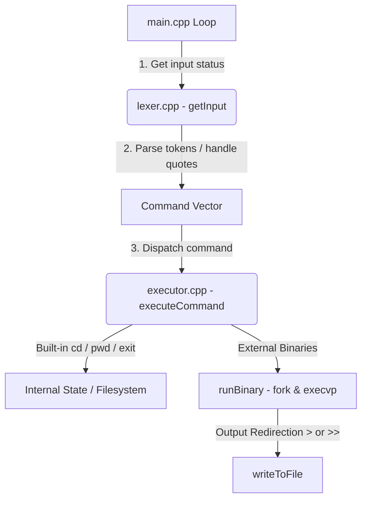

# ChSh (Chetan Shell) 🐚

`ChSh` is a lightweight, Unix-like command-line shell built from scratch in modern C++ (C++23). It parses inputs, manages directories, handles command executions, and supports redirection protocols using POSIX APIs.

---

## ✨ Features

- **💡 Dynamic & Colored Prompt**: 
  - Displays your current working directory with home directory (`/Users/chetan`) automatically prettified as `~`.
  - Real-time visual feedback: The prompt turns **red** if the previous command returned an error/failed.
- **🛠️ Command Execution**:
  - Automatically forks processes and runs system binaries (e.g., `ls`, `grep`, `mkdir`, `top`) using `fork` and `execvp`.
- **📂 Built-in Commands**:
  - `cd`:
    - `cd <path>`: Navigate to any target directory.
    - `cd ~`: Navigate to the home directory.
    - `cd`: Acts as a toggle to switch back to the **previously visited directory**.
  - `pwd`: Prints the current absolute path of your working directory.
  - `exit`: Safely quits the shell environment.
- **📥 Output Redirection**:
  - `>`: Redirects output from any command, overwriting the destination file.
  - `>>`: Redirects output from any command, appending to the destination file.
- **🧠 Intelligent Lexer & Tokenizer**:
  - Correctly parses arguments enclosed in double quotes (e.g., `"hello world"` is kept as a single argument).

---

## 🏗️ Project Architecture



### File Structure

- **[src/main.cpp](file:///Users/chetan/Desktop/ChSh/src/main.cpp)**: The main shell REPL loop managing state and flow control.
- **[src/lexer.cpp](file:///Users/chetan/Desktop/ChSh/src/lexer.cpp)**: Standard inputs reader, prompt formatter (with color indicators), and argument parser.
- **[src/executor.cpp](file:///Users/chetan/Desktop/ChSh/src/executor.cpp)**: Command router handling built-in directory navigation, redirection, and low-level child process management.
- **[CMakeLists.txt](file:///Users/chetan/Desktop/ChSh/CMakeLists.txt)**: Cross-platform CMake configuration requiring C++23.

---

## 🚀 Getting Started

### Prerequisites

- A C++ compiler supporting C++23 (e.g., GCC 13+, Clang 16+, or Apple Clang).
- [CMake](https://cmake.org/) (Version 3.23 or newer).

### Build Instructions

1. **Clone the repository:**
   ```bash
   git clone git@github.com:Chetan-boi/ChSh.git
   cd ChSh
   ```

2. **Configure & Build using CMake:**
   ```bash
   cmake -B build -DCMAKE_BUILD_TYPE=Release
   cmake --build build
   ```

### Running the Shell

Once compiled successfully, run the generated binary:
```bash
./build/ChSh
```

---

## 📝 Usage Examples

**Changing Directories & Toggling:**
```bash
[~] >> cd Desktop/ChSh
[/Users/chetan/Desktop/ChSh] >> cd /var
[/var] >> cd
# Toggles back to /Users/chetan/Desktop/ChSh
[/Users/chetan/Desktop/ChSh] >> cd ~
[~] >>
```

**Using Redirection:**
```bash
[~] >> ls -la > files_list.txt
[~] >> echo "new log entry" >> logs.txt
```

**Handling Spaces in Arguments:**
```bash
[~] >> mkdir "My Folder with Spaces"
```
