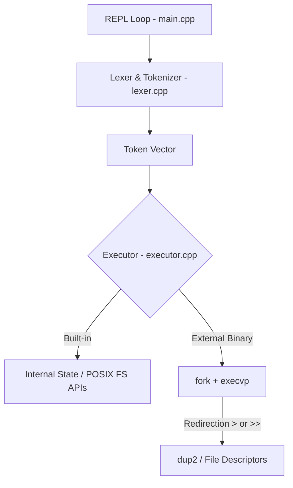

# ChSh (Chetan Shell)

`ChSh` is a lightweight, Unix-like command-line shell built from scratch in modern C++ (C++23). It parses inputs, manages directories, handles command executions, and supports redirection protocols using POSIX APIs.

---

## Features

- **Process Execution:** Forks and executes external binaries via `execvp` with parent-process signal and exit-status monitoring.
- **I/O Redirection:** Truncating (`>`) and appending (`>>`) output redirection handled via file descriptors (`dup2`).
- **Quote-Aware Parsing:** Tokenizer preserves arguments enclosed in double quotes (e.g., `"hello world"`).
- **Custom Built-ins:**
  - `cd <path>`: Directory navigation (supports `~`).
  - `cd`: Toggles between the current and previous directory (custom shortcut for `cd -`).
  - `pwd`: Resolves working directory via `getcwd`.
  - `history`: Lists successful executions persisted to `~/.ChSh_history`.
  - `exit`: Clean shell termination.
- **Status Prompt:** Shortens `$HOME` to `~` and updates color based on the previous command's exit code (green for `0`, red for non-zero).

---

## Architecture


```mermaid
graph TD
    A[REPL Loop - main.cpp] --> B[Lexer & Tokenizer - lexer.cpp]
    B --> C[Token Vector]
    C --> D{Executor - executor.cpp}
    D -->|Built-in| E[Internal State / POSIX FS APIs]
    D -->|External Binary| F[fork + execvp]
    F -->|Redirection > or >>| G[dup2 / File Descriptors]
```

### File Tree

- `src/main.cpp`: REPL entry point and signal flow.
- `src/lexer.cpp`: Terminal input handler, prompt styling, and quote-aware tokenization.
- `src/executor.cpp`: Command dispatch, built-in logic, I/O redirection, and child process management.
- `CMakeLists.txt`: Build configuration requiring C++23.

---

## Building & Installation

### Requirements

- C++23 compliant compiler (Clang 16+, GCC 13+, or Apple Clang)
- CMake 3.23+

```bash
git clone https://github.com/Chetan-boi/ChSh.git
cd ChSh
cmake -B build -DCMAKE_BUILD_TYPE=Release
cmake --build build
```

Run the binary:

```bash
./build/ChSh
```

---

## Examples

```bash
[~] >> mkdir "Target Directory"
[~] >> cd "Target Directory"
[~/Target Directory] >> cd /var
[/var] >> cd
[~/Target Directory] >> ls -la > manifest.txt
[~/Target Directory] >> history
mkdir "Target Directory"
cd "Target Directory"
cd /var
cd
ls -la > manifest.txt
```

